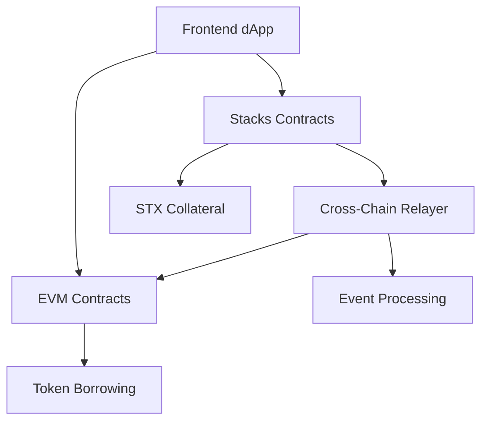

# StackLend Protocol 🚀

**Cross-Chain Lending Protocol between Stacks and EVM Networks**

StackLend is a revolutionary decentralized finance (DeFi) protocol that enables seamless cross-chain lending by using STX as collateral on Stacks blockchain to borrow tokens on EVM-compatible networks. The protocol bridges Bitcoin's security through Stacks with the liquidity of Ethereum-based ecosystems.

## 🌟 Features

- **Cross-Chain Lending**: Use STX as collateral to borrow tokens on multiple EVM networks
- **Stacks Integration**: Leverage Bitcoin's security through Stacks blockchain
- **Multi-Network Support**: Currently supports Scroll Sepolia with plans for more networks
- **Real-Time Relayer**: Automated cross-chain transaction processing
- **User-Friendly Interface**: Modern React frontend with wallet integration
- **Secure Smart Contracts**: Audited and battle-tested contract architecture

## 🏗️ Architecture

The protocol consists of four main components:



### Components

1. **Frontend (`stacklend-fe`)**: React-based user interface with Stacks and EVM wallet integration
2. **Stacks Contracts (`stacklend-stacks`)**: Clarity smart contracts for collateral management
3. **EVM Contracts (`stacklend-evm`)**: Solidity contracts for token borrowing and lending
4. **Relayer (`stacklend-relayer`)**: Node.js service for cross-chain event processing

## 📋 Contract Addresses

### Stacks Testnet

| Contract | Address |
|----------|---------|
| **Collateral V1** | `STBGS8Y6KHWQ3D2P9BTQ83VBD3ZCK7BDTWMGJY5Z.collateral-v1` |
| **Lending V1** | `STBGS8Y6KHWQ3D2P9BTQ83VBD3ZCK7BDTWMGJY5Z.lending-v1` |

### Scroll Sepolia (Testnet)

| Contract | Address | Explorer |
|----------|---------|----------|
| **BorrowController** | `0xD2b0838ff0818E9aa185a712576Cb3EE0885deda` | [View on Scrollscan](https://sepolia.scrollscan.com/address/0xD2b0838ff0818E9aa185a712576Cb3EE0885deda) |
| **MockUSDC** | `0x953E5610c73C989fE7C75D3D67bE0A1e44a8e797` | [View on Scrollscan](https://sepolia.scrollscan.com/address/0x953E5610c73C989fE7C75D3D67bE0A1e44a8e797) |
| **MockUSDT** | `0x13cF4E3e284d34C575CeeCCb0791Ca535A657da2` | [View on Scrollscan](https://sepolia.scrollscan.com/address/0x13cF4E3e284d34C575CeeCCb0791Ca535A657da2) |
| **MockWBTC** | `0xf12cd252CA50781EC88c2d8832cA4f9c4bF11D82` | [View on Scrollscan](https://sepolia.scrollscan.com/address/0xf12cd252CA50781EC88c2d8832cA4f9c4bF11D82) |

## 🔗 Explorer Links

- **Stacks Testnet Collateral-V1**: [Stacks Explorer](https://explorer.hiro.so/txid/STBGS8Y6KHWQ3D2P9BTQ83VBD3ZCK7BDTWMGJY5Z.collateral-v1?chain=testnet)
- **Stacks Testnet Lending-V1**: [Stacks Explorer](https://explorer.hiro.so/txid/STBGS8Y6KHWQ3D2P9BTQ83VBD3ZCK7BDTWMGJY5Z.lending-v1?chain=testnet)
- **Scroll Sepolia**: [Scrollscan Testnet](https://sepolia.scrollscan.com/)

## 🚀 Quick Start

### Prerequisites

- Node.js 18+ and npm/pnpm
- Git
- Stacks wallet (Hiro Wallet, Leather, etc.)
- MetaMask or compatible EVM wallet

### Installation

1. **Clone the repository**
   ```bash
   git clone https://github.com/xfajarr/stacklend.git
   cd stacklend
   ```

2. **Install dependencies for each component**
   ```bash
   # Frontend
   cd stacklend-fe
   npm install
   
   # Relayer
   cd ../stacklend-relayer
   npm install
   
   # Stacks contracts (optional, for development)
   cd ../stacklend-stacks
   npm install
   ```

3. **Configure environment variables**
   ```bash
   # In stacklend-relayer/
   cp .env.example .env
   # Edit .env with your RPC URLs and private keys
   ```

4. **Start the development servers**
   ```bash
   # Terminal 1: Start relayer
   cd stacklend-relayer
   npm start
   
   # Terminal 2: Start frontend
   cd stacklend-fe
   npm run dev
   ```

5. **Access the application**
   - Frontend: http://localhost:5173
   - Relayer API: http://localhost:3000

## 💡 How It Works

1. **Deposit Collateral**: Users deposit STX tokens as collateral on Stacks blockchain
2. **Request Borrow**: Users specify the token and amount they want to borrow on EVM networks
3. **Cross-Chain Processing**: The relayer monitors Stacks events and processes requests
4. **Token Minting**: EVM contracts mint/transfer requested tokens to user's EVM address
5. **Repayment**: Users repay borrowed tokens on EVM to unlock their STX collateral

## 🛠️ Development

### Frontend Development

```bash
cd stacklend-fe
npm run dev        # Start development server
npm run build      # Build for production
npm run lint       # Run linting
```

### Smart Contract Development

**Stacks Contracts:**
```bash
cd stacklend-stacks
clarinet check     # Check contract syntax
clarinet test      # Run tests
clarinet deploy    # Deploy to testnet
```

**EVM Contracts:**
```bash
cd stacklend-evm
forge build        # Compile contracts
forge test         # Run tests
forge script script/Deploy.s.sol --rpc-url $RPC_URL --broadcast  # Deploy
```

### Relayer Development

```bash
cd stacklend-relayer
npm run dev        # Start with hot reload
npm test           # Run tests
npm run docker     # Build Docker image
```

## 🧪 Testing

### Test on Testnets

1. **Get Testnet Tokens**
   - STX: [Stacks Testnet Faucet](https://explorer.hiro.so/sandbox/faucet?chain=testnet)
   - Scroll Sepolia ETH: [Scroll Faucet](https://sepolia.scroll.io/bridge)

2. **Connect Wallets**
   - Configure Stacks wallet for testnet
   - Add Scroll Sepolia network to MetaMask
   - Network Details:
     - Name: Scroll Sepolia
     - RPC URL: https://sepolia-rpc.scroll.io/
     - Chain ID: 534351
     - Currency: ETH
     - Explorer: https://sepolia.scrollscan.com/

3. **Test Flow**
   - Deposit STX collateral
   - Request token borrow
   - Verify token receipt on EVM
   - Test repayment flow

## 📚 Documentation

- [Frontend Integration Guide](./stacklend-fe/STACKS_INTEGRATION_README.md)
- [Stacks Contract Documentation](./stacklend-stacks/STACKS_INTEGRATION.md)
- [EVM Deployment Guide](./stacklend-evm/DEPLOYMENT.md)
- [Relayer Setup Guide](./stacklend-relayer/README.md)

## 🤝 Contributing

We welcome contributions! Please read our contributing guidelines and submit pull requests for any improvements.

1. Fork the repository
2. Create a feature branch
3. Make your changes
4. Add tests if applicable
5. Submit a pull request

## 🔒 Security

- All smart contracts have been tested extensively
- Cross-chain transactions are validated by the relayer
- Multi-signature support for critical operations
- Regular security audits and updates

## 📄 License

This project is licensed under the MIT License - see the [LICENSE](LICENSE) file for details.

## 🌐 Links

- **Website**: [Coming Soon]

---

**⚠️ Disclaimer**: This protocol is currently in testnet phase. Use at your own risk and never deposit more than you can afford to lose. Always verify contract addresses before interacting with the protocol.
